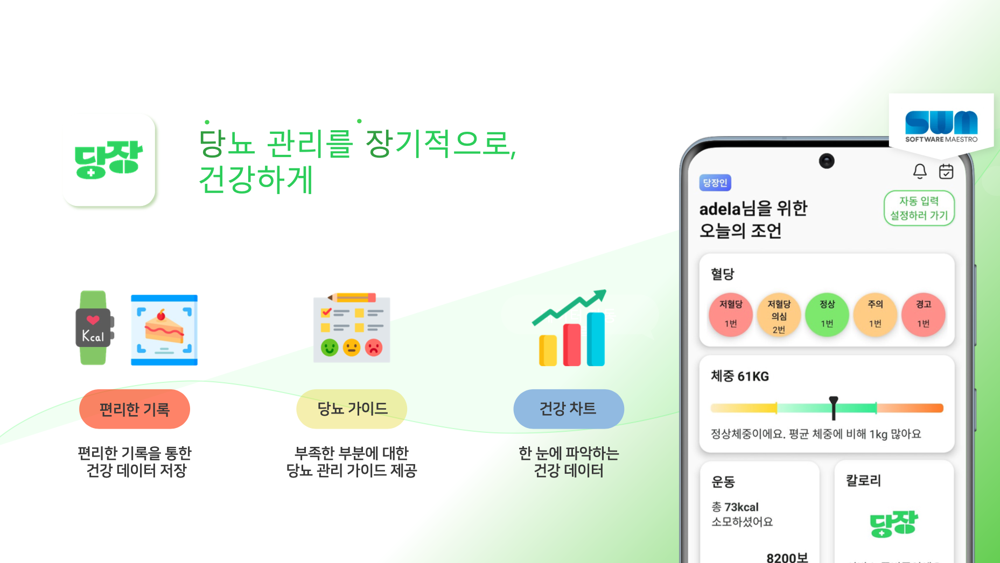
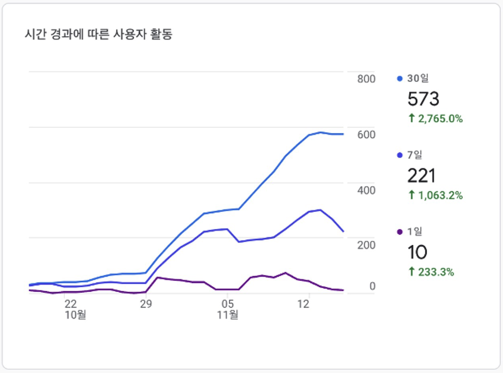
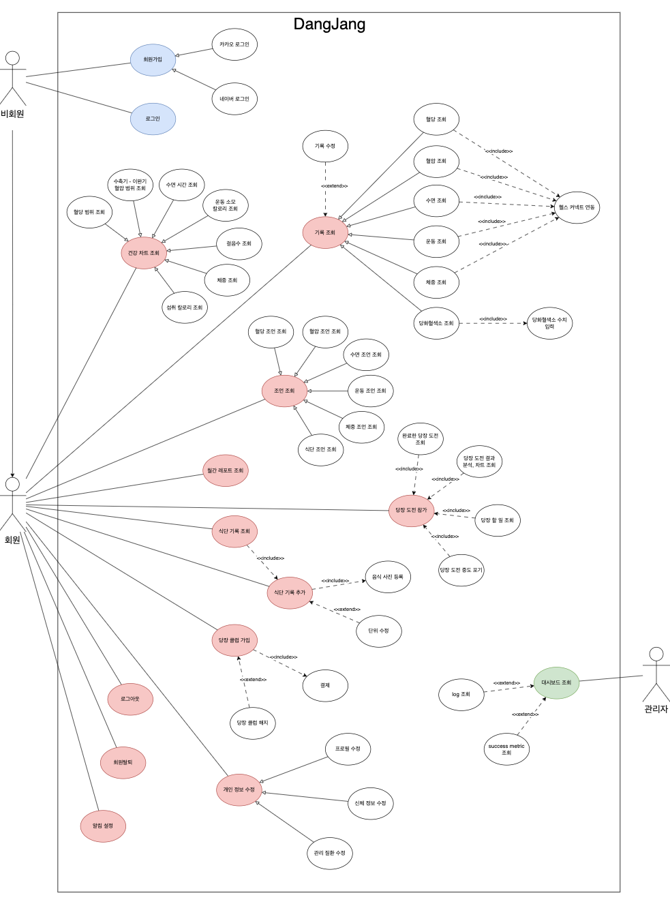
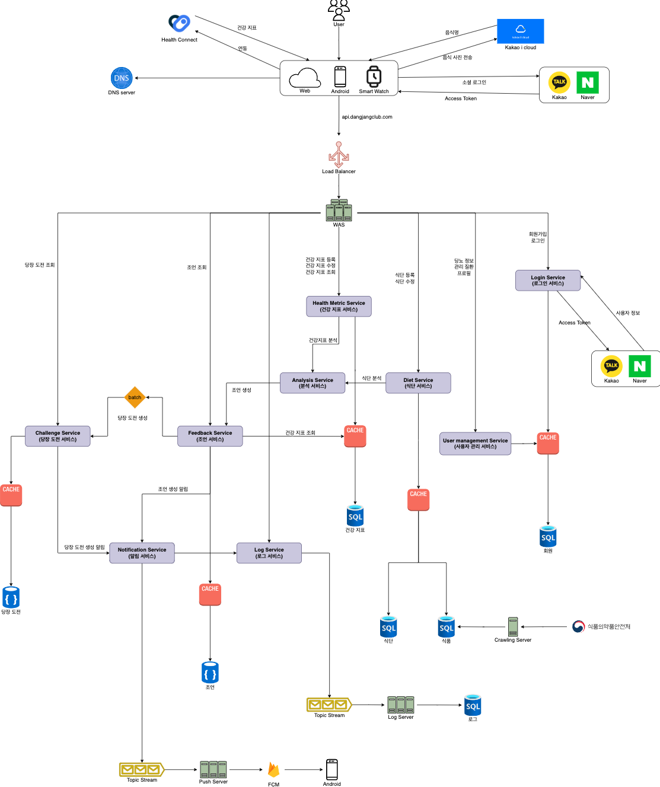
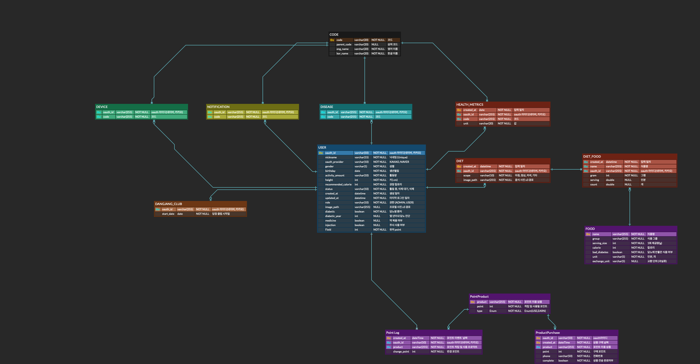
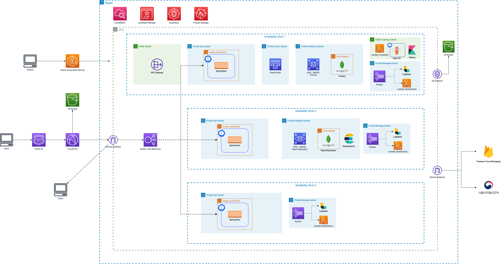

# 당장 서비스

# 문서 제목

## 목차

- [1. 서비스 소개](#1-서비스-소개)
- [2. 서비스 기능 소개](#2-서비스-기능-소개)
- [3. 서비스 성과](#3-서비스-성과)
- [4. 서비스 설계](#4-서비스-설계)
    - [4.1. USE CASE](##4.1-USE-CASE)
    - [4.2. ARCHITECTURE](##4.2-ARCHITECTURE)
    - [4.3. ERD](##4.3-ERD)
    - [4.4. AWS ARCHITECTURE](##4.4-AWS-ARCHITECTURE)

## 1. 프로젝트 소개

여기서 프로젝트 소개 내용을 작성합니다.

## 2. 기능 소개

여기서 기능 소개 내용을 작성합니다.

## 3. 설치 방법

여기서 설치 방법을 작성합니다.

## 1. 서비스 소개

[당장 - 당뇨 관리, 혈당, 식단, 기록, 체중, 운동 - Google Play 앱](https://play.google.com/store/apps/details?id=com.dangjang.android&hl=ko-KR)

당장은 당뇨를 편리하게 기록하고 개선할 수 있도록 가이드를 제공하는 서비스입니다. 혈당, 체중, 운동, 식단 관리에 대한 건강 가이드를 통해 사용자의 생활 습관 관리를 돕고, 당뇨 관리를 조금 더 편하게 할 수 있는 사회를 만들고자 합니다.

## 2. 서비스 기능 소개

주요 기능은 헬스커넥트 연동을 통한 건강 데이터 자동 기록, 건강 데이터 분석을 통한 가이드, 건강 데이터를 한 눈에 파악할 수 있는 건강 차트가 있습니다.

► 건강 데이터를 자동으로 기록해요.

아직 건강 데이터로 수기로 입력하시나요? ‘당장’에서 자동으로 기록된 건강 데이터를 확인해 보세요. 핸드폰뿐만 아니라 스마트 워치, 삼성 헬스에서 수집한 데이터도 자동으로 기록할 수 있습니다!

► 건강 데이터를 분석해서 가이드를 제공해요.

내분비내과 교수와 협업한 내용을 바탕으로 기록된 건강 데이터에 대해 전문적인 가이드를 전달해 드리고 있어요. 가이드를 보고 어떤 부분이 관리가 부족한지, 관리를 잘하고 있는지 쉽게 파악할 수 있어요

► 다양한 방식으로 지급되는 포인트!

당뇨도 관리하고 포인트도 얻고 일석이조! 쌓인 포인트는 기프티콘으로 교환할 수 있어요. 자세한 내용은 앱에서 확인하세요.

► 혈당, 체중, 칼로리 등 건강 데이터 변화를 한 눈에 확인해요.

주 단위의 건강 데이터 변화를 차트로 시각화해서 제공하고 있어요. 나의 건강 추이를 한 눈에 보면서 ‘당장’과 함께 꾸준히 개선해 보아요!

## 3. 서비스 성과

DAU 10명 , WAU 220명 , MAU 570명 성과를 달성하였습니다.

## 4. 서비스 설계

### 4.1. USE CASE

### 4.2. ARCHITECTURE

### 4.3. ERD

### 4.4. AWS ARCHITECTURE

